# Sufni.Bridge

Sufni.Bridge is a cross-platform telemetry analysis app for MTB suspension data, built with .NET and Avalonia.  
It processes recorded sessions from the [Sufni Suspension Telemetry](https://github.com/sghctoma/sst) DAQ and focuses on practical, offline-first trail tuning.

## What the app does

- Imports telemetry sessions from DAQ/network storage
- Analyzes **front/rear travel and velocity behavior**
- Shows per-session pages: **Summary, Spring, Damper, Balance, Misc, Notes**
- Supports **crop (non-destructive trim)** of sessions
- Supports **compare** mode for side-by-side session analysis
- Supports **combine** mode to merge interrupted runs
- Exports analysis to **PDF**
- Lets you manage **linkages** and **calibrations**

## iOS Screenshots

> All images below are referenced from `Sufni.Bridge/Sufni.Bridge.iOS/screenshots`.

### Session list, filter, and session details

| Session list | Filter | Summary tab |
|---|---|---|
| 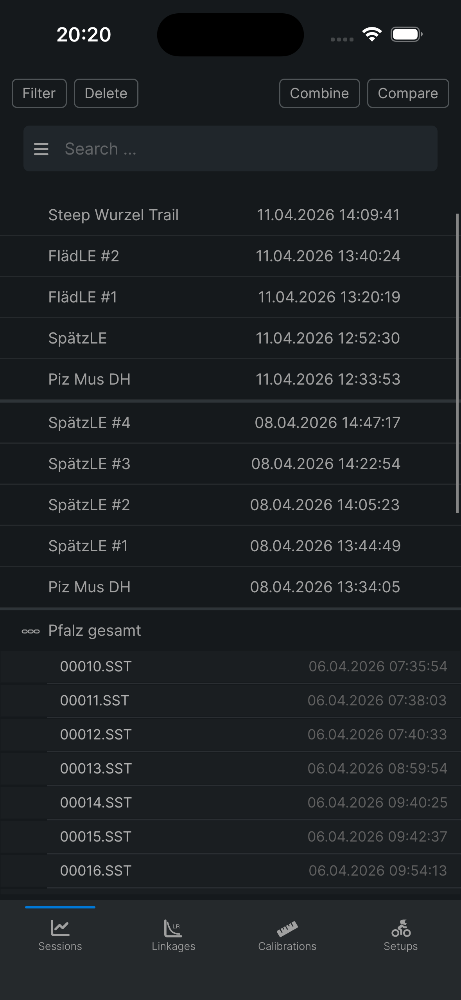 | 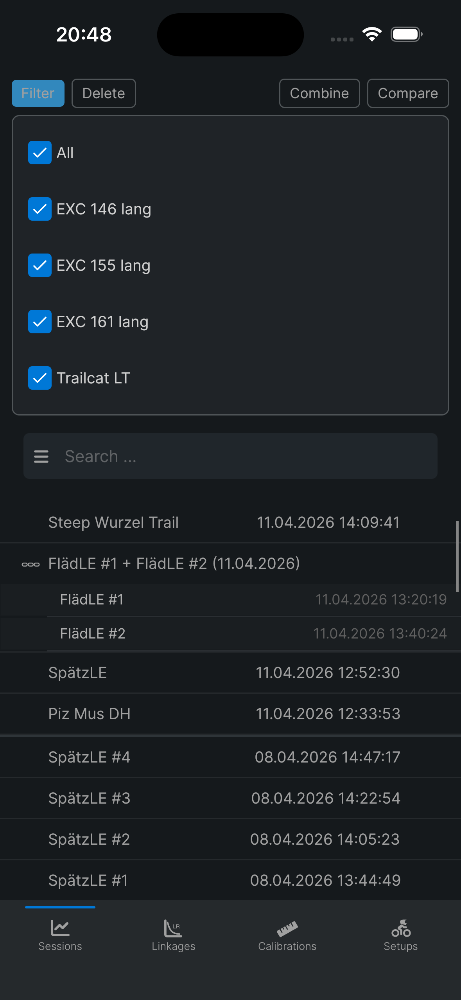 | 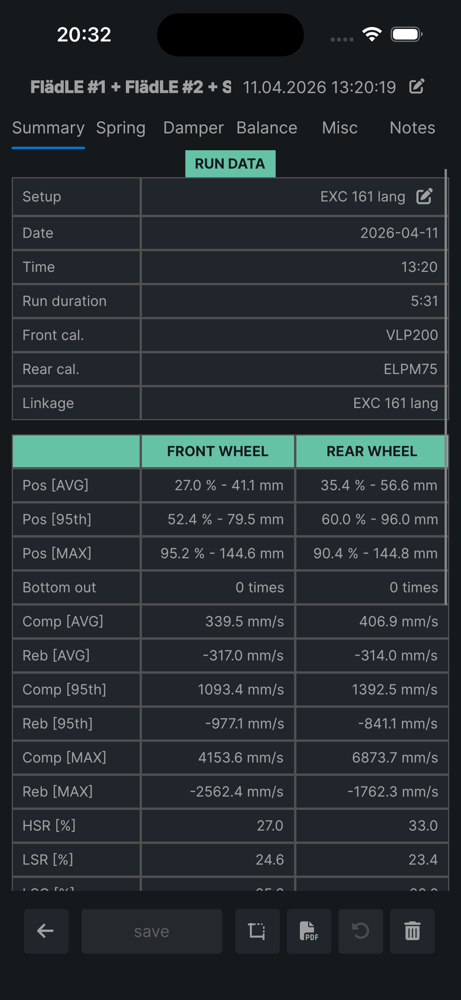 |

### Analysis tabs

| Spring | Damper | Balance |
|---|---|---|
| 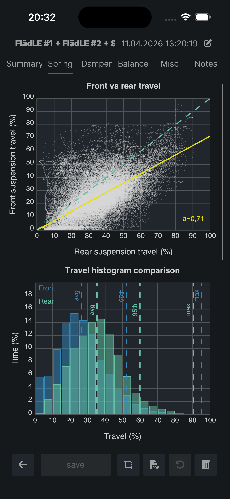 | 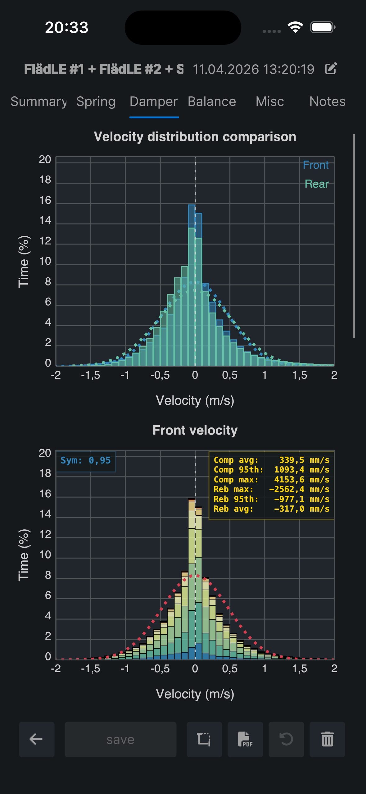 | 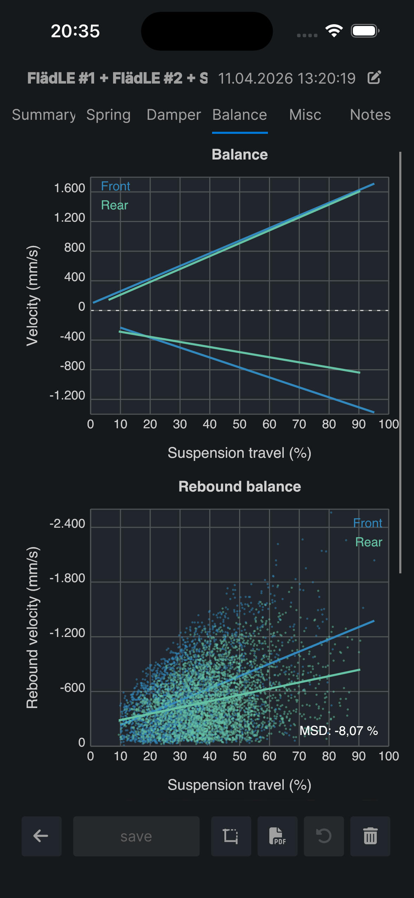 |

| Misc | Notes | Setup in Summary |
|---|---|---|
| 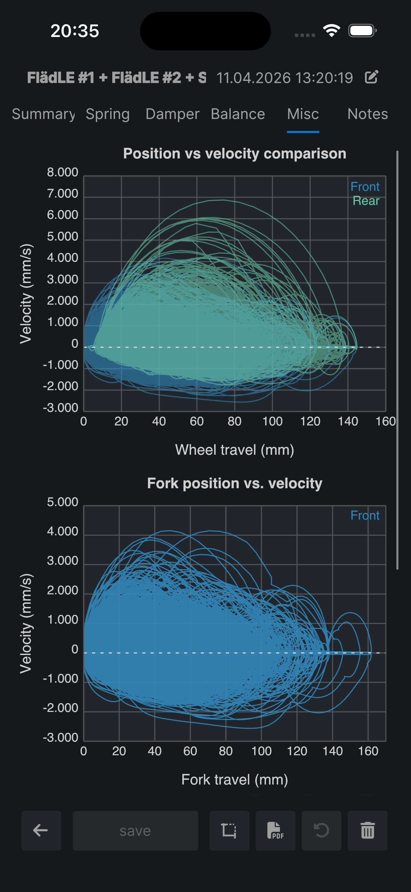 | 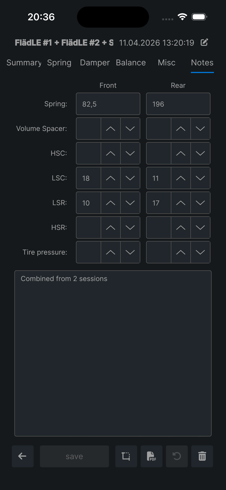 | 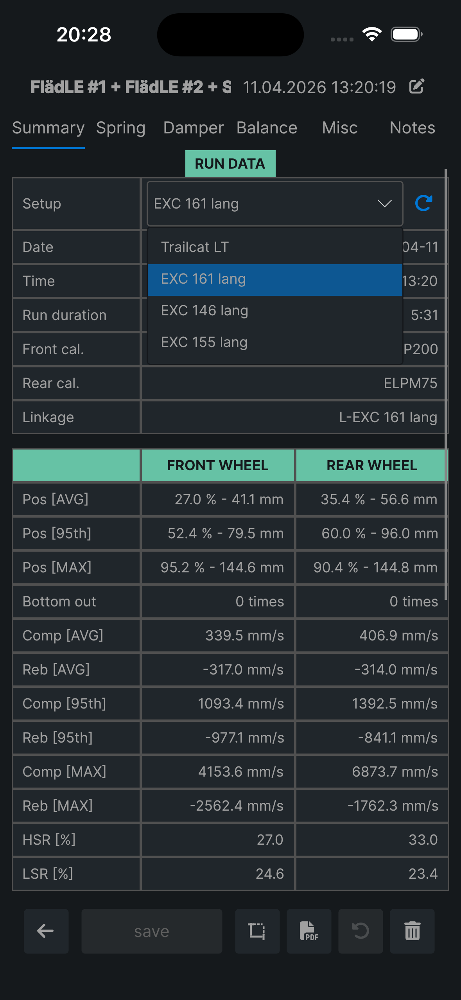 |

### Crop, compare, combine

| Crop | Compare | Combine |
|---|---|---|
| 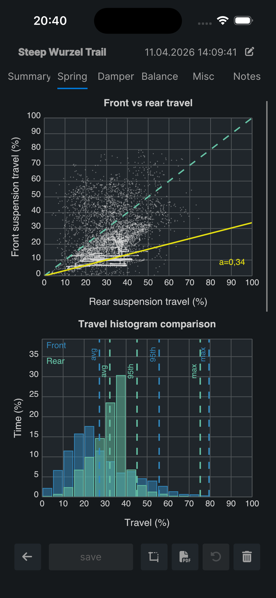 | 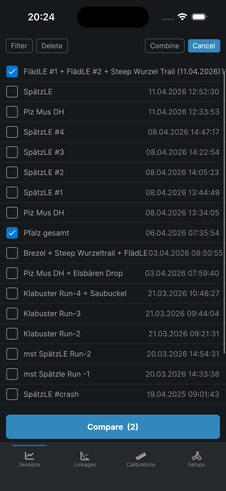 | 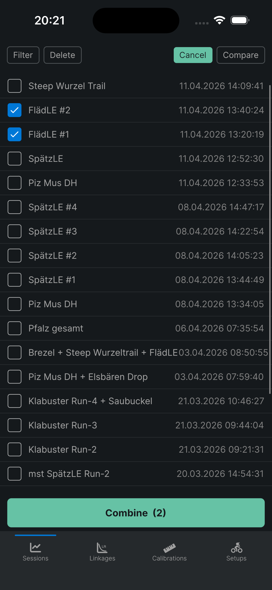 |

## Core workflow

1. **Import sessions** from your DAQ source  
2. Open a session and inspect:
   - **Summary:** key stats (position/velocity, bottom-out count, damping ratios)
   - **Spring:** travel histograms + front/rear distribution behavior
   - **Damper:** velocity distributions and low/high speed zones
   - **Balance:** compression vs rebound balance
   - **Misc:** additional derived information
   - **Notes:** setup notes (spring, volume spacer, clicker settings, tire pressure)
3. Optionally **crop** the run to isolate the relevant section
4. **Compare** sessions to evaluate setup changes
5. **Combine** interrupted recordings into one unified analysis
6. **Export PDF** for sharing or long-term documentation

## Project structure

- `Sufni.Bridge/` – main Avalonia application
- `Sufni.Bridge/Sufni.Bridge.iOS/` – iOS host project
- `HapticFeedback/`, `SecureStorage/`, `ServiceDiscovery/` – platform/service libraries
- `Sufni.Bridge/Sufni.Bridge.iOS/screenshots/` – iOS screenshots used in this README

## Build (local development)

### Prerequisites

- .NET SDK (see `global.json`)
- Avalonia-compatible environment for your target platform
- For iOS builds: Xcode + iOS workload

### Restore and build

```bash
dotnet restore Sufni.Bridge.sln
dotnet build Sufni.Bridge.sln
```

### iOS project build

```bash
dotnet build Sufni.Bridge/Sufni.Bridge.iOS/Sufni.Bridge.iOS.csproj
```

## Current scope / limitations

- Focused on telemetry analytics and setup workflows
- No GPS map or video overlay
- Designed to work without cloud dependency in core usage

---

\* *Pronounced “SHOOF-nee Bridge”. “Sufni” is Hungarian for tool shed and is also used colloquially for DIY/garage-style engineering.*
